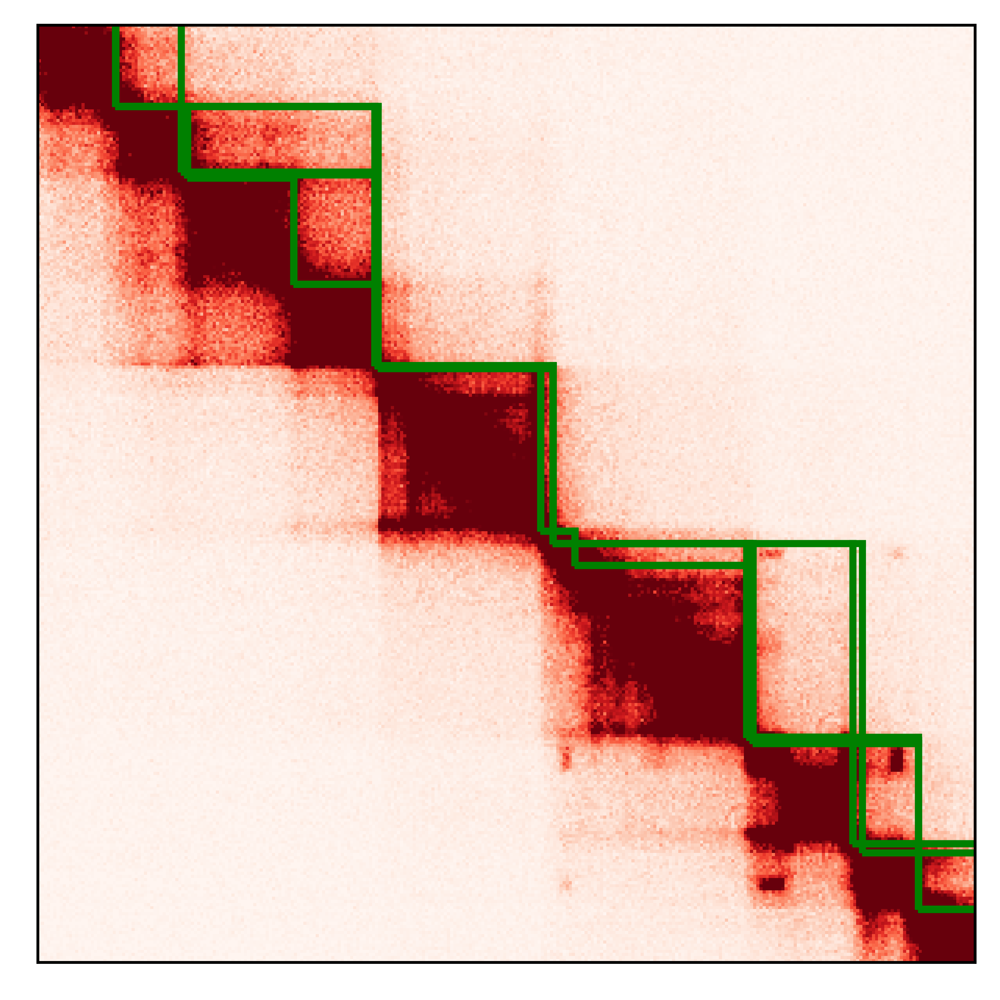

# Genome community finder #
This tool uses graph theory to identify communities in 3D genome folding data (Hi-C). These communities represent topological domains that are of interest in disease and development.

This tool is a simplified version of 3DNetMod (Norton,Emerson et al, Nature Methods 2018).      

Plotting example uses lib5c package     

# README #

### How do I get set up? ###

sh setup_venv.sh    

### Guidelines ###

### Step 1 ###
run run_modularity.py    
(run as "sh run_modularity.sh".  Example provided)    

Prior to running this code raw Hi-C matrices should be balanced. Chromosome balanced .npz sparse matrix is
used as input.    

#### input ####

--npz = chromosome sparse matrix .npz in input_files subdirectory    
--chrom = chromosome of sparse matrix (str)      
--res = resolution basepair of sparse matrix (int)   

#### Output ####
output boundary bed in output/boundary_files/ subdirectory    

### Step 2 ###
run plot_domain.py    

(example input provided in plot_domain.sh. Run as "sh plot_domain.sh")    

#### input ####

heatmap = chromosome sparse matrix .npz in input_files directory  (same as step 1)   
domains = domain calls bed file in output/boundary_files/ directory (step 1 output)    
chromosome = chromosome of parse matrix (str)     
start = start coordinate of plot (int)    
end = end coordinate of plot (int)     
resolution = resolution basepair of sparse matrix (same as step 1) (int)    
max_color = maximum color of plot (int)        

#### Output ####
output placed in output/ subdirectory    
*{domains}*'_' + args.chr  + '_' + str(start)  + '_' + str(end) + '_' +  str(args.max_color) + '.png'    

### Contact ###

* Daniel Emerson, demerson368@gmail.com

